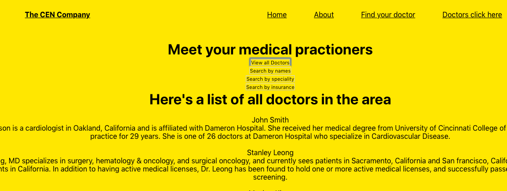

# Building MERN Site

## Description

The purpose of this website was to create a React frontend to work with an API i created. This site has full CRUD functionalites whereby it can create, edit, read and delete data. In the near future, i hope to add more css styles to the website and make it more responsive.

## Technologies:
* React
* Medical directory API
* VS code

## Required Installations:
* Fork and clone (or just clone) the repository
    * `git clone https://github.com/cenwachukwu/frontend-mern`
    * cd into the directory
* Inside the directory install the dependencies:
    * `npm install`
* To open the code in vs code, run code .
* To run this site, run `npm run start`

## Extras:
* Deployed site:
    * https://frontend-mern.cenwachukwuu.now.sh/
* Link to repo:
    * github: https://github.com/cenwachukwu/frontend-mern